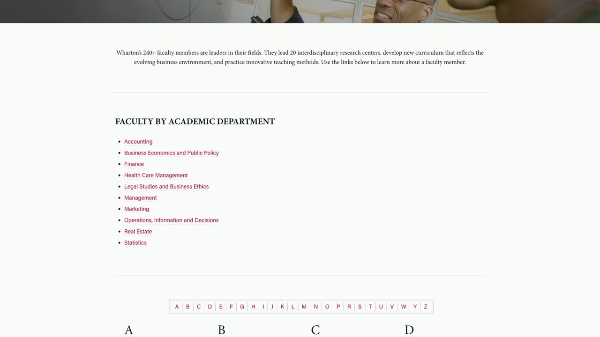

# Web Scroller Tool

Create an MP4 video of a web page scrolling at a steady speed. The tool opens the URL in headless Chrome, captures viewport screenshots at fixed scroll offsets, and streams those frames into `ffmpeg`.

The default output is 1080p: `1920x1080`, `30 fps`, H.264 MP4.

## Getting Started With Codex

Open Codex and ask it to install the skill:

```text
Install the web scroll video skill from https://github.com/upenn/web-scroll-video
```

Restart Codex after the install finishes. Then ask Codex to check your computer:

```text
Check the web scroll video dependencies and install anything missing.
```

Then describe the video you want in plain English:

```text
Make a 60 fps 1080p video of https://zamechek.com. Pause 1 second, click Blog, scroll slowly to the bottom and back to the top, click the first Keynot post, then scroll slowly to the bottom. Show the cursor.
```

Codex will create a cue sheet, render the MP4, and keep the cue sheet and video together so revisions are easy. To revise, ask for changes the same way you would give notes to an editor, such as “make the first scroll slower,” “hide the cursor,” or “add a two second pause before the click.”

## Requirements

- Node.js 22 or newer
- Google Chrome, Chromium, or Microsoft Edge
- `ffmpeg`

No npm packages are required for this tool. Codex can check and help install these dependencies. `npm` is only needed if you are installing the Codex CLI itself or managing Node.js on a command-line machine.

## Manual Install Reference

Manual install:

```bash
mkdir -p "${CODEX_HOME:-$HOME/.codex}/skills"
git clone https://github.com/upenn/web-scroll-video.git \
  "${CODEX_HOME:-$HOME/.codex}/skills/web-scroll-video"
```

If using the Codex skill installer helper directly:

```bash
python3 "${CODEX_HOME:-$HOME/.codex}/skills/.system/skill-installer/scripts/install-skill-from-github.py" \
  --repo upenn/web-scroll-video \
  --path . \
  --name web-scroll-video
```

Restart Codex after installing so the skill is discovered.

On macOS with Homebrew, missing dependencies can usually be installed with:

```bash
brew install node ffmpeg
brew install --cask google-chrome
```

On a fresh Debian or Ubuntu VM, Codex can install the browser and video tools with commands like:

```bash
sudo apt-get update
sudo apt-get install -y chromium chromium-sandbox ffmpeg git ca-certificates fonts-liberation
```

If you are testing from the command line on a Linux VM and need to install Codex first, install Node.js 22 or newer, then run:

```bash
sudo npm install -g @openai/codex
codex login
```

If Chrome is already installed somewhere nonstandard, pass its path with `--chrome-path` or set `CHROME_PATH`.

## Command Line Quick Start

Capture the Wharton home page from this repository:

```bash
npm run capture:wharton
```

This writes:

```text
wharton-scroll.mp4
```

Capture any other URL:

```bash
npm run capture -- https://example.com --out example-scroll.mp4
```

Run the CLI directly:

```bash
node src/scroll-video.mjs https://www.wharton.upenn.edu/ --out wharton-scroll.mp4
```

## Cue Sheets

Use a cue sheet when a video needs pauses, clicks, typing, zooms, or highlights. Cue sheets are sequence-style: each line happens after the previous one.

```text
out: wharton-demo.mp4
width: 1920
height: 1080
fps: 60
cursor: off

go https://www.wharton.upenn.edu/faculty-directory/
pause 1
highlight "Faculty Directory" for 1
scroll to 1800 over 4
pause 0.75
click "Departments"
pause 1
type "finance" into "Search"
pause 1
zoom to 1.2 over 1
scroll to bottom over 5
```

Render it with:

```bash
node src/scroll-video.mjs --script wharton-demo.cue
```

In script mode, relative `out:` paths are resolved next to the cue sheet. If no `out:` is provided, the MP4 uses the cue filename with `.mp4`.

Or run the included example:

```bash
npm run capture:wharton-demo
```

The included cue sheet renders this demo MP4:

[](examples/wharton-faculty-demo.mp4)

[Open the demo MP4](examples/wharton-faculty-demo.mp4).

Supported cue actions:

```text
go https://example.com
pause 1.5
scroll to bottom over 5
scroll to 1800 over 4
scroll to "Visible text" over 4
scroll by 800 over 2
click "Visible text"
click selector ".button-class"
type "search terms" into "Search"
press Enter
wait text "Results" timeout 10
zoom to 1.2 over 1
highlight "Important text" for 1.5
```

Notes:

- `cursor: off` is the default. Use `cursor: on` in the cue sheet or pass `--cursor` to show a rendered cursor.
- Keep cue-driven outputs beside their cue files. For `cues/demo.cue`, `out: demo.mp4` writes `cues/demo.mp4`; omitting `out:` also writes `cues/demo.mp4`.
- Pauses capture live frames, so page animations continue during the pause.
- Highlights are temporary overlays around visible text, labels, or CSS selectors.
- `scroll to "Visible text" over 4` scrolls until that text is centered in the viewport.
- If a click, type target, wait, or highlight fails, the tool writes an error report and screenshot next to the output file.
- Cue sheets may also be written as JSON for generated workflows, but `.cue` text files are easier to edit by hand.

## Options

```text
--script <path>        Run a sequence-style cue sheet (.cue, .txt, or .json).
--out <path>           Output MP4 path. Default: scroll-video.mp4, or <script>.mp4 in script mode.
--width <px>           Viewport width. Default: 1920
--height <px>          Viewport height. Default: 1080
--fps <number>         Video frames per second. Default: 30
--speed <px/sec>       Scroll speed in CSS pixels per second. Default: 480
--duration <seconds>   Override speed and fit full scroll into this duration.
--delay <ms>           Extra wait after page load. Default: 1500
--warmup-step <px>     Lazy-load warmup scroll step. Default: viewport height
--chrome-path <path>   Chrome/Chromium/Edge executable path.
--ffmpeg-path <path>   ffmpeg executable path. Default: ffmpeg
--crf <number>         H.264 quality, lower is better. Default: 18
--cursor               Show a rendered cursor overlay in script mode.
--storyboard <dir>     Save one PNG screenshot after each script step.
--keep-browser         Leave the temporary Chrome profile directory in place.
--help                 Show CLI help.
```

## Examples

Render a 20 second scroll:

```bash
node src/scroll-video.mjs https://www.wharton.upenn.edu/ \
  --out wharton-20s.mp4 \
  --duration 20
```

Render at a faster steady scroll speed:

```bash
node src/scroll-video.mjs https://www.wharton.upenn.edu/ \
  --out wharton-fast.mp4 \
  --speed 900
```

Render a mobile-shaped viewport:

```bash
node src/scroll-video.mjs https://www.wharton.upenn.edu/ \
  --out wharton-mobile.mp4 \
  --width 1080 \
  --height 1920
```

Use explicit binary paths:

```bash
node src/scroll-video.mjs https://www.wharton.upenn.edu/ \
  --out wharton-scroll.mp4 \
  --chrome-path "/Applications/Google Chrome.app/Contents/MacOS/Google Chrome" \
  --ffmpeg-path /opt/homebrew/bin/ffmpeg
```

## How It Works

1. Launch a temporary headless Chrome profile with DevTools enabled.
2. Open the URL and wait for page load.
3. In one-shot mode, scroll through the page once to trigger lazy-loaded content.
4. In cue-sheet mode, run the sequence of pauses, scrolls, clicks, typing, zooms, and highlights.
5. Capture PNG frames and pipe them into `ffmpeg` to produce an H.264 MP4.

One-shot scroll mode renders deterministic scroll positions, so the final video scrolls at a steady speed even if individual screenshots take different amounts of time to capture. Cue-sheet mode captures timed actions so page animations can continue during pauses and interactions.

## Validation

Run the Docker smoke test:

```bash
npm test
```

This creates `docker-output/smoke.mp4` from the current checkout in a clean Linux container. To test the public GitHub install path instead, run:

```bash
npm run test:docker:github
```

The Docker smoke test does not run or authenticate Codex. It validates the renderer with clean Linux installs of Chromium and `ffmpeg`; test Codex login separately on a VM or desktop with `codex login`.

Check the generated video metadata:

```bash
ffprobe -v error \
  -select_streams v:0 \
  -show_entries stream=width,height,r_frame_rate,duration,codec_name \
  -of default=noprint_wrappers=1 \
  wharton-scroll.mp4
```

Expected defaults include:

```text
codec_name=h264
width=1920
height=1080
r_frame_rate=30/1
```

## Troubleshooting

If Chrome is not found, pass `--chrome-path` or set `CHROME_PATH`.

If `ffmpeg` is not found, pass `--ffmpeg-path` or set `FFMPEG_PATH`.

If a page loads content slowly, increase `--delay`:

```bash
node src/scroll-video.mjs https://example.com --delay 4000
```

If a page lazy-loads content only after smaller scroll increments, reduce `--warmup-step`:

```bash
node src/scroll-video.mjs https://example.com --warmup-step 400
```

If the capture runs in a sandboxed environment, it may need permission to access the target URL and open a local DevTools port on `127.0.0.1`.

If Chromium fails inside Docker with a namespace or sandbox error, test in a normal VM or use a Docker-only Chrome wrapper that launches Chromium with `--no-sandbox`. That flag is normally a container workaround, not the recommended desktop or VM path.

If a cue step fails, inspect the generated files:

```text
<output-name>.error.json
<output-name>.error.png
```

The JSON report includes the failure message, current URL, intended output path, and screenshot path.

## License

MIT. See [LICENSE](LICENSE).
